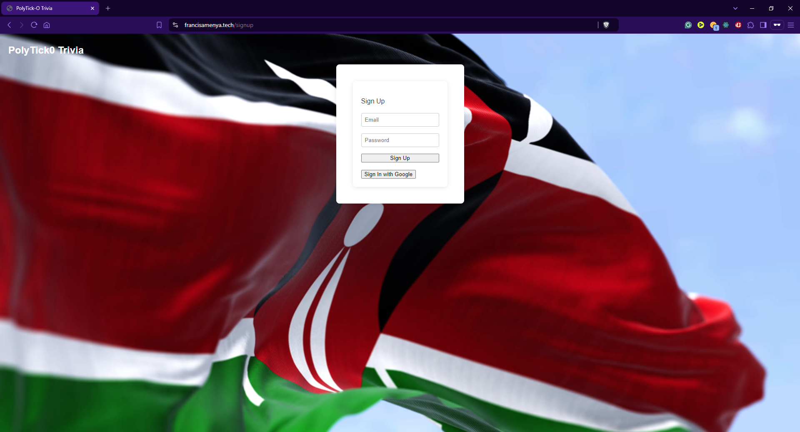

Only God Can Save Kenya.
All thoughts expressed are my own.

<a name="top"></a>

<div class="cover-image">
    
</div>

[](https://docs.abblix.com/docs/getting-started-guide)
[](#-license)

⭐ Star us on GitHub — it motivates us a lot!

[](https://x.com/intent/tweet?text=Check%20out%20this%20project%20on%20GitHub:%20https://github.com/FrancisAmenya/tick0%20%23OpenIDConnect%20%23Security%20%23Authentication)
[](https://www.facebook.com/sharer/sharer.php?u=https://github.com/FrancisAmenya/tick0)
[](https://www.linkedin.com/sharing/share-offsite/?url=https://github.com/FrancisAmenya/tick0)
[](https://www.reddit.com/submit?title=Check%20out%20this%20project%20on%20GitHub:%20https://github.com/FrancisAmenya/tick0)
[](https://t.me/share/url?url=https://github.com/FrancisAmenya/tick0&text=Check%20out%20this%20project%20on%20GitHub)

🔥 Why PolyTick0 is the best Civic Education Game [presentation](https://uxpress.substack.com/p/polytick0) 📑

## Table of Contents
- [About](#-about)
- [How to Build](#-how-to-build)
- [Documentation](#-documentation)
- [Feedback and Contributions](#-feedback-and-contributions)
- [License](#-license)
- [Contacts](#%EF%B8%8F-contacts)

## 🚀 About

**PolyTick0** is an effort to improve Civic Education in Africa. This was driven purely by the turmoil in the contemporary African political landscape. There are wars, famine, droughts, floods, terrorist attacks and other catastrophies plaguing the African political landscape. Making a visual distraction with simple controls distracts from the linear nature of the quiz questions. Players get to interact with amazing visuals with comical themes to enhance their experience in the game. Players read information about what is happenning in and around their neighbouring countries' political landscape. News about freedom fighters, updates on recent political moves and changes will be found here.


- **Responsive Design**: A mobile-first friendly design with robust responsiveness for a quick and seamless user experience on all devices.

- **Oauth**: Oauth via Google’s Firebase for secure and faster sign-ups and logins.

- **Civic Education**: A better understanding of your leaders and their expenditures, failed projects, successes, and what they don’t want you to know.


## 📝 How to Build

To build the packages, follow these steps:

```shell
# Open a terminal (Command Prompt or PowerShell for Windows, Terminal for macOS or Linux)

# Ensure Git is installed
# Visit https://git-scm.com to download and install console Git if not already installed

# Clone the repository
git clone https://github.com/FrancisAmenya/tick0.git

# Navigate to the project directory
cd tick0

# Navigate to the server directory
cd server

# Install dependencies
npm install
sudo apt-get install mongodb mongosh mongod nginx

# Start the server
npm run dev

# in a new Window navigate to the project client's directory
cd tick0/client

# Install dependencies
npm install

# Build the client
npm run build

# Start the server
npm start


## 📚 Documentation 

### Getting Started
Explore the [Getting Started Guide](https://francisamenya.tech/docs/getting-started-guide).
In this guide, you will create a working solution step by step, for Civic Education.

## 🤝 Feedback and Contributions

We've made every effort to implement all the main aspects of PolyTick0 user friendly in the best possible way. However, the development journey doesn't end here, and your input is crucial for our continuous improvement.

> [!IMPORTANT]
> Whether you have feedback on features, have encountered any bugs, or have suggestions for enhancements, we're eager to hear from you. Your insights help us make the PolyTick0 more robust and user-friendly.

Please feel free to contribute by [submitting an issue](https://github.com/FrancisAmenya/tick0/issues) or [joining the discussions](https://github.com/FrancisAmenya/tick0/discussions). Each contribution helps us grow and improve.

We appreciate your support and look forward to making our product even better with your help!

## 📃 License

This product is distributed under a proprietary license. You can review the full license agreement at the following link: [Standard License Agreement for Abblix OIDC Server](https://francisamenya.tech/license).

For non-commercial use, this product is available for free.

## 🗨️ Contacts

For more details about our products, services, or any general information regarding PolyTick0, feel free to reach out to us. We are here to provide support and answer any questions you may have. Below are the best ways to contact our team:

- **Email**: Send us your inquiries or support requests at [support@francisamenya.tech](mailto:support@francisamenya.tech).
- **Website**: Visit the official PolyTick0 website for more information: [PolyTick0](https://francisamenya.tech).

Subscribe to our LinkedIn and Twitter:

[![LinkedIn](https://img.shields.io/badge/subscribe-white.svg?logo=data:image/svg%2bxml;base64,PHN2ZyB2aWV3Qm94PSIwIDAgMjQgMjQiIHhtbG5zPSJodHRwOi8vd3d3LnczLm9yZy8yMDAwL3N2ZyI+PHBhdGggZD0iTTIwLjQ0NyAyMC40NTJoLTMuNTU0di01LjU2OWMwLTEuMzI4LS4wMjctMy4wMzctMS44NTItMy4wMzctMS44NTMgMC0yLjEzNiAxLjQ0NS0yLjEzNiAyLjkzOXY1LjY2N0g5LjM1MVY5aDMuNDE0djEuNTYxaC4wNDZjLjQ3Ny0uOSAxLjYzNy0xLjg1IDMuMzctMS44NSAzLjYwMSAwIDQuMjY3IDIuMzcgNC4yNjcgNS40NTV2Ni4yODZ6TTUuMzM3IDcuNDMzYTIuMDYyIDIuMDYyIDAgMCAxLTIuMDYzLTIuMDY1IDIuMDY0IDIuMDY0IDAgMSAxIDIuMDYzIDIuMDY1em0xLjc4MiAxMy4wMTlIMy41NTVWOWgzLjU2NHYxMS40NTJ6TTIyLjIyNSAwSDEuNzcxQy43OTIgMCAwIC43NzQgMCAxLjcyOXYyMC41NDJDMCAyMy4yMjcuNzkyIDI0IDEuNzcxIDI0aDIwLjQ1MUMyMy4yIDI0IDI0IDIzLjIyNyAyNCAyMi4yNzFWMS43MjlDMjQgLjc3NCAyMy4yIDAgMjIuMjIyIDBoLjAwM3oiIGZpbGw9IiMwQTY2QzIiLz48cGF0aCBzdHlsZT0iZmlsbDojZmZmO3N0cm9rZS13aWR0aDouMDIwOTI0MSIgZD0iTTQuOTE3IDcuMzc3YTIuMDUyIDIuMDUyIDAgMCAxLS4yNC0zLjk0OWMxLjEyNS0uMzg0IDIuMzM5LjI3NCAyLjY1IDEuNDM3LjA2OC4yNS4wNjguNzY3LjAwMSAxLjAxYTIuMDg5IDIuMDg5IDAgMCAxLTEuNjIgMS41MSAyLjMzNCAyLjMzNCAwIDAgMS0uNzktLjAwOHoiLz48cGF0aCBzdHlsZT0iZmlsbDojZmZmO3N0cm9rZS13aWR0aDouMDIwOTI0MSIgZD0iTTQuOTE3IDcuMzc3YTIuMDU2IDIuMDU2IDAgMCAxLTEuNTItMi42NyAyLjA0NyAyLjA0NyAwIDAgMSAzLjQxOS0uNzU2Yy4yNC4yNTQuNDIuNTczLjUxMi45MDguMDY1LjI0LjA2NS43OCAwIDEuMDItLjA1MS4xODYtLjE5Ny41MDQtLjMuNjUyLS4wOS4xMzItLjMxLjM2Mi0uNDQzLjQ2NC0uNDYzLjM1Ny0xLjEuNTAzLTEuNjY4LjM4MlpNMy41NTcgMTQuNzJWOS4wMDhoMy41NTd2MTEuNDI0SDMuNTU3Wk05LjM1MyAxNC43MlY5LjAwOGgzLjQxMXYuNzg1YzAgLjYxNC4wMDUuNzg0LjAyNi43ODMuMDE0IDAgLjA3LS4wNzMuMTI0LS4xNjIuNTI0LS44NjUgMS41MDgtMS40NzggMi42NS0xLjY1LjI3NS0uMDQyIDEtLjA0NyAxLjMzMi0uMDA5Ljc5LjA5IDEuNDUxLjMxNiAxLjk0LjY2NC4yMi4xNTcuNTU3LjQ5My43MTQuNzEzLjQyLjU5Mi42OSAxLjQxMi44MDggMi40NjQuMDc0LjY2My4wODQgMS4yMTUuMDg1IDQuNTc4djMuMjU4aC0zLjUzNnYtMi45ODZjMC0yLjk3LS4wMS0zLjQ3NC0uMDc0LTMuOTA4LS4wOS0uNjA2LS4zMTQtMS4wODItLjYzNC0xLjM0Mi0uMzk1LS4zMjItMS4wMjktLjQzNy0xLjcwMy0uMzA5LS44NTguMTYzLTEuMzU1Ljc1LTEuNTIzIDEuNzk3LS4wNzYuNDcxLS4wODQuODQ1LS4wODQgMy44MzR2Mi45MTRIOS4zNTN6Ii8+PC9zdmc+)](https://www.linkedin.com/in/francisamenya/)
[](https://x.com/uxpressed/)

We look forward to assisting you and ensuring your experience with our products is successful and enjoyable!

[Back to top](#top)
